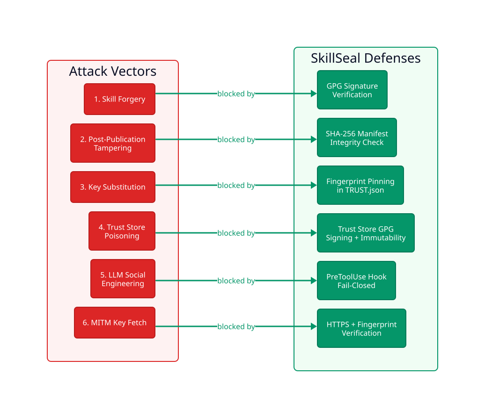
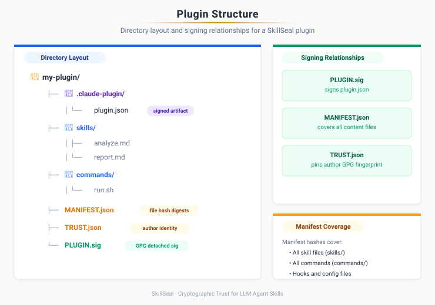
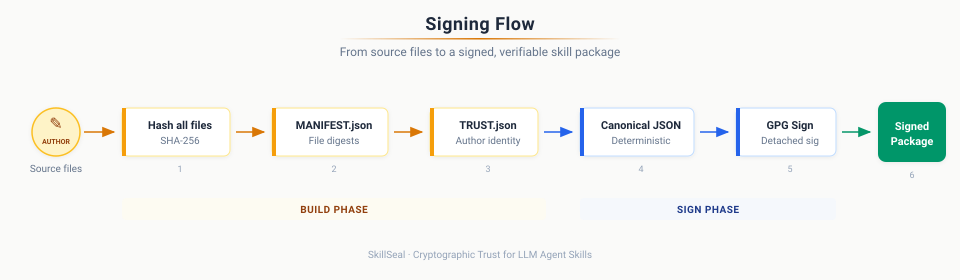
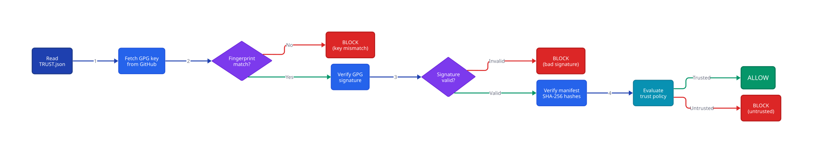
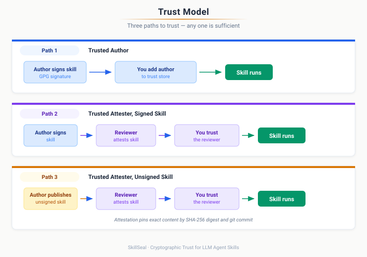
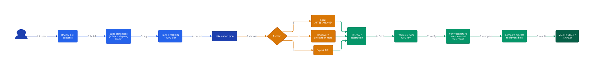
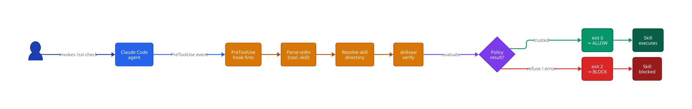

# Abstract

Large language model agents execute skills and plugins — Markdown documents, command definitions, hook scripts, and agent configurations that function as installers with full system privileges. No standard mechanism exists to verify who authored these artifacts or whether they have been modified after publication. Independent audits of major agent skill repositories have found 12–20% of published skills to be actively malicious.

SkillSeal addresses this gap with a lightweight, self-bootstrapping cryptographic signing framework for LLM agent skill packages and plugins. Authors sign artifacts with GPG keys discoverable through GitHub's existing public key infrastructure. A SHA-256 manifest ensures file-level integrity. A local trust store with configurable policy enables agents to make deterministic trust decisions without user intervention for known authors and reviewers. Independent reviewers can add attestations — GPG-signed statements pinned to exact artifact digests — building a decentralized web of trust.

A PreToolUse hook for Claude Code enforces verification at the point of execution with a fail-closed security model: any skill that fails verification is blocked before it can run.

SkillSeal operates at the artifact layer, complementing rather than replacing transport-layer solutions (OAuth, TLS), gateway products, and container isolation. It fills a specific gap in the current landscape: no existing tool provides a portable, self-bootstrapping, artifact-level signing standard that individual authors can adopt today.

# Introduction

## The Unsigned Executable Content Problem

LLM agents are capable instruction followers. When given a skill — a set of instructions describing how to accomplish a task — an agent will execute those instructions to achieve the user's stated goal. The agent optimizes for task completion, not security. It does not independently evaluate whether the *path* to completing a task is safe.

A skill is executable content. If a skill contains installation instructions, the agent follows them. If a skill tells the agent to fetch a binary from a URL and add it to PATH, the agent complies — it is achieving the user's intent. The side effect may be that malware is installed alongside a working calendar widget.

This is the confused deputy problem with an LLM as the deputy.

The attack pattern is straightforward:

1. Publish a skill that promises useful functionality
2. Include instructions that also perform malicious actions
3. The agent executes both — the useful part satisfies the user, the malicious part operates silently

## The Scale of the Problem

The threat is not theoretical. Independent audits and security research have documented widespread exploitation:

**OpenClaw skill repository compromise.** Audits of OpenClaw's ClawHub — the largest open-source agent skill repository with 190,000+ GitHub stars — found 386 of 2,857 skills (12–20%) were actively malicious, primarily delivering Atomic Stealer (AMOS) malware to macOS. A skill called "What Would Elon Do?" was gamed to the number-one position while silently exfiltrating data. Over 135,000 internet-facing OpenClaw instances were discovered leaking plaintext API keys and chat histories. Three CVEs were assigned, including one-click remote code execution (CVSS 8.8).

**Slopsquatting.** Analysis of 756,000 AI-generated code samples found that approximately 20% recommend packages that do not exist. Attackers register these hallucinated package names on npm and PyPI with malware payloads, turning AI coding assistants into malware distribution vectors.

**MCP tool poisoning.** Research demonstrates that malicious instructions embedded in MCP tool descriptions achieve 72–84% attack success rates against frontier models. More capable models are more vulnerable — Claude 3.7 Sonnet's refusal rate was under 3%. SkillSeal does not address this attack vector — it operates at the artifact layer, not the protocol layer. However, knowing *who published* an MCP server configuration is a prerequisite for accountability.

**Rules file backdoor.** Invisible Unicode characters in AI coding assistant configuration files cause agents to silently produce backdoored code. The attack persists across sessions and survives project forking.

**s1ngularity/Nx compromise.** The first documented malware weaponizing AI coding agents — invoking Claude Code, Gemini CLI, and Amazon Q with unsafe flags and embedded exfiltration prompts.

As 1Password's research team observed: "Markdown isn't 'content' in an agent ecosystem. Markdown is an installer."

## Core Thesis

Signing does not prove code is safe. It proves **provenance** and **integrity**. That distinction is critical.

An agent's trust decision requires answers to four questions:

- **Who authored this skill?** (provenance)
- **Has it been tampered with since authoring?** (integrity)
- **Do I have reason to trust that author?** (trust chain)
- **Has anyone I trust reviewed this?** (attestation)

Cryptographic signing provides the first two and the mechanism for the second two. GitHub stars provide a weak, gameable popularity signal. A cryptographic signature provides an identity that can accumulate reputation over time and be verified mechanically.

## Scope

SkillSeal operates at the **artifact layer**. It signs and verifies the skill packages and plugins that agents execute. It does not address:

- Transport-layer security (OAuth, TLS) — these are complementary
- Container isolation — SkillSeal identifies *what* is running, not *how* to sandbox it
- Protocol-level MCP security — SkillSeal does not inspect, validate, or secure MCP tool descriptions or server behavior. If a plugin includes an `.mcp.json` configuration, it is covered by the manifest hash (tamper detection), but SkillSeal has no understanding of what the MCP tools do
- Centralized registries — SkillSeal is decentralized by design

# Threat Model

SkillSeal defends against six primary attack vectors. Each maps to a specific defense mechanism.



## Attack Vectors and Defenses

### Skill Forgery

**Attack:** An adversary publishes a malicious skill under a false identity, impersonating a trusted author.

**Defense:** GPG signature verification. The skill's detached signature (`SKILL.sig` or `PLUGIN.sig`) is verified against the author's public key fetched from GitHub. A forged skill cannot produce a valid signature without the author's private key.

### Post-Publication Tampering

**Attack:** An adversary modifies files in a skill package after the author has signed it — injecting malicious instructions, altering referenced scripts, or adding exfiltration code.

**Defense:** SHA-256 manifest integrity. The `MANIFEST.json` file records the SHA-256 digest of every file in the package. The manifest's own digest is embedded in the signed artifact's frontmatter. Any file modification, addition, or deletion is detected.

### Key Substitution

**Attack:** An adversary intercepts the key discovery process and substitutes their own public key for the author's, allowing their forged signature to verify.

**Defense:** Fingerprint pinning. The `TRUST.json` file in each package records the expected GPG fingerprint. After fetching the key from GitHub, SkillSeal verifies that the imported key's fingerprint matches the pinned value. A substituted key with a different fingerprint is rejected.

### Trust Store Poisoning

**Attack:** A compromised agent or malicious skill instructs the LLM to run `skillseal trust add` with an attacker's fingerprint, adding the attacker as a trusted author. Subsequent malicious skills signed by the attacker pass verification.

**Defense:** Four-layer trust store hardening (detailed in Section 9): GPG-signed trust store requiring passphrase for modification, file immutability flags, root ownership, and PreToolUse hook command blocking.

### LLM Social Engineering

**Attack:** Prompt injection in a skill's instructions attempts to convince the agent to skip verification, ignore hook results, or treat an unsigned skill as trusted.

**Defense:** PreToolUse hook enforcement (detailed in Section 8). The hook executes as a separate process outside the LLM's context. The LLM cannot influence the hook's decision — it runs `skillseal verify` independently and returns `exit 0` (allow) or `exit 2` (block). The hook is fail-closed: any error blocks execution.

### Man-in-the-Middle Key Fetch

**Attack:** An adversary with network position (corporate proxy, compromised CDN edge, DNS poisoning) intercepts the HTTPS request to `github.com/{username}.gpg` and serves a different key.

**Defense:** HTTPS transport provides baseline protection. Fingerprint pinning in `TRUST.json` provides defense-in-depth — even if the key fetch is intercepted, the substituted key's fingerprint will not match the expected value. The combination means an attacker must compromise both the transport layer and the pinned fingerprint.

## What SkillSeal Does Not Prevent

- **A trusted author publishing malicious code.** Signing proves identity, not intent. A trusted author who publishes a malicious update will pass verification. The current policy engine does not require attestations for trusted authors — `known_author_no_attestations` defaults to `allow`. The mitigation is to revoke trust (`skillseal trust remove`) when an author is compromised or acts maliciously.
- **Key compromise.** If an author's private key is stolen, the attacker can produce valid signatures. Key revocation support is planned (Section 12).
- **Vulnerabilities in skill logic.** SkillSeal verifies provenance and integrity, not functional correctness. A skill that accidentally exposes an SSRF vector will pass verification if the author signed it.
- **Zero-day exploitation of GPG itself.** SkillSeal delegates cryptographic operations to GPG. A vulnerability in GPG affects all systems that depend on it.

# Architecture

## Design Principles

SkillSeal's architecture is guided by five principles:

**Lightweight.** The entire system is a CLI tool, a trust store, and a hook script. No daemons, no servers, no databases. Signing and verification complete in milliseconds.

**Self-bootstrapping.** The verification skill (`skillseal-verify/SKILL.md`) is itself signed. An agent that trusts this one artifact gains the capability to verify everything else — analogous to a root CA certificate shipped with an operating system.

**Decentralized.** No central authority controls who can sign or attest. Authors sign with their own GPG keys. Reviewers publish their own attestations. Trust decisions are local to each user's trust store.

**Composable.** SkillSeal operates at the artifact layer and composes with any transport, gateway, or isolation mechanism. An enterprise proxy can consume SkillSeal signatures alongside its own policy. A container runtime can verify signatures before mounting a skill volume.

**Fail-closed.** Every error condition — missing files, parse failures, network errors, GPG crashes — results in blocking the skill, not allowing it. The system defaults to denying execution.

## Components

| Component | Purpose |
|-----------|---------|
| `skillseal sign <dir>` | Sign a skill or plugin (auto-detected) |
| `skillseal verify <dir>` | Verify signature, manifest, and trust policy |
| `skillseal sign-all <dir>` | Batch-sign all skills and plugins in a directory |
| `skillseal attest <dir>` | Create a reviewer attestation bundle |
| `skillseal init <dir>` | Scaffold a new skill package |
| `skillseal trust <cmd>` | Manage the local trust store |
| `hooks/skill-verify.ts` | PreToolUse enforcement hook for Claude Code |
| `skillseal-verify/SKILL.md` | Skill teaching LLMs to verify (self-signed) |
| `skillseal-sign/SKILL.md` | Skill teaching LLMs to sign (self-signed) |

## Skill Package Structure

A signed skill package contains four files alongside the skill content:

```
my-skill/
├── SKILL.md          # The skill instructions (signed artifact)
├── SKILL.sig         # Detached GPG signature over SKILL.md
├── MANIFEST.json     # SHA-256 hashes of all package files
├── TRUST.json        # Author identity and key metadata
└── ATTESTATIONS/     # Reviewer and scanner attestation bundles
```

`SKILL.md` is the signed artifact — the single file whose GPG signature anchors the entire package. The manifest hash embedded in its YAML frontmatter binds all other files to the signature.

## Plugin Package Structure



Plugins are the distribution unit for Claude Code extensions. A plugin bundles skills, commands, hooks, and agents into a single package. If an `.mcp.json` configuration is present, it is included in the manifest like any other file — SkillSeal verifies its integrity but does not inspect its contents. SkillSeal signs the entire plugin as one unit:

```
my-plugin/
├── .claude-plugin/
│   └── plugin.json   # Plugin metadata (signed artifact)
├── skills/           # Skill packages
├── commands/         # Slash command definitions
├── hooks/            # Hook scripts
├── agents/           # Agent definitions
├── PLUGIN.sig        # Detached GPG signature of plugin.json
├── MANIFEST.json     # SHA-256 hashes of all plugin files
├── TRUST.json        # Author identity and key metadata
└── README.md
```

The `sign` and `verify` commands auto-detect whether a directory is a plugin (contains `.claude-plugin/plugin.json`) or a standalone skill (contains `SKILL.md`). One signature covers all contents.

## The Self-Bootstrapping Property

A critical architectural property: the system can verify itself before any external trust is established.

The SkillSeal verification skill (`skillseal-verify/SKILL.md`) is signed with standard GPG. A user can verify it using raw GPG commands — no SkillSeal CLI required:

```bash
curl -sL https://github.com/mcyork.gpg | gpg --import
gpg --verify skillseal-verify/SKILL.sig skillseal-verify/SKILL.md
```

Once this single manual trust decision is made, the agent has the capability to verify every subsequent skill autonomously. This is the same pattern as a root CA certificate: one trust anchor bootstraps the entire system.

# Signing Protocol

## Signed Artifact Format

### Skills

The signed artifact is `SKILL.md`. Its YAML frontmatter contains the fields that bind the signature to the package:

```yaml
---
skill: ssl-certificate-checker
version: 1.0.0
author: ian@esoup.net
github: mcyork
author_fingerprint: 7097CE1EF54E0808FD3855427ED9682FF64286D0
signed: true
manifest_hash: sha256:a1b2c3d4e5f6...
---
```

### Plugins

The signed artifact is `.claude-plugin/plugin.json`. Signing metadata is embedded directly in the JSON:

```json
{
  "name": "skillseal-demo-plugin",
  "version": "1.0.0",
  "description": "SSL certificate checker plugin",
  "author": { "name": "Ian McCutcheon", "email": "ian@esoup.net" },
  "signed": true,
  "author_fingerprint": "7097CE1EF54E0808FD38...",
  "manifest_hash": "sha256:504861f3a997..."
}
```

## Manifest Algorithm

The manifest records SHA-256 digests of all files in the package directory, with specific exclusions:

**Excluded from skill manifests:**

- `SKILL.sig` (the signature itself)
- `MANIFEST.json` (the manifest itself — would create circularity)
- `TRUST.json` (written independently; integrity bound through the signature chain)
- `ATTESTATIONS/` directory (independently verifiable)
- Hidden files and directories (names starting with `.`)

**Excluded from plugin manifests:**

- `PLUGIN.sig`, `MANIFEST.json`, `TRUST.json` (same rationale)
- `.claude-plugin/plugin.json` (the signed artifact — excluded to break circularity)
- `ATTESTATIONS/`, `.git/`, `node_modules/`

The manifest format:

```json
{
  "schema_version": "0.1.0",
  "generated_at": "2026-02-14T00:00:00Z",
  "algorithm": "sha256",
  "files": {
    "SKILL.md": "abcdef1234567890...",
    "src/helper.py": "fedcba0987654321..."
  }
}
```

File paths use forward slashes and are relative to the package root.

## The Convergence Loop

A circular dependency exists between the signed artifact and the manifest: the manifest hash is embedded in `SKILL.md` (or `plugin.json`), but `SKILL.md` is itself a file whose content affects the manifest.

SkillSeal resolves this with an iterative convergence loop:



1. Write `TRUST.json` with author identity and fingerprint
2. Walk the directory and compute SHA-256 hashes of all eligible files
3. Write `MANIFEST.json` with the computed hashes
4. Compute SHA-256 of `MANIFEST.json` and embed it in the signed artifact's frontmatter
5. Check if the manifest hash has changed since the last iteration
6. If changed, return to step 2 (the signed artifact's content changed, which changes its hash in the manifest)
7. If stable, sign the artifact with GPG

For skills, convergence typically occurs in 2–3 iterations. For plugins, convergence is immediate (one iteration) because `plugin.json` is excluded from the manifest — its content changes do not affect the manifest hash.

## Step-by-Step Signing Flow

1. **Auto-detect package type.** Check for `.claude-plugin/plugin.json` (plugin) or `SKILL.md` (skill).
2. **Write TRUST.json.** Record author name, email, GitHub username, fingerprint, and key URL.
3. **Enter convergence loop:**
   a. Walk directory, compute SHA-256 hashes (respecting exclusion sets)
   b. Write `MANIFEST.json`
   c. Compute `sha256:` prefixed digest of `MANIFEST.json`
   d. Update the signed artifact's frontmatter with the manifest hash
   e. If manifest hash differs from previous iteration, repeat
4. **Sign.** Produce a detached, ASCII-armored GPG signature:
   - Skills: `gpg --detach-sign --armor --output SKILL.sig SKILL.md`
   - Plugins: `gpg --detach-sign --armor --output PLUGIN.sig .claude-plugin/plugin.json`

Supported key types: RSA (2048+ bit), Ed25519, Ed448. Ed25519 is recommended.

# Verification Protocol

## Key Discovery

Author public keys are discovered through GitHub's existing GPG key endpoint:

```
https://github.com/{username}.gpg
```

This requires no custom infrastructure. Developers who sign git commits already have keys published here. Everyone else is one `gpg --gen-key` and a GitHub settings page away.

The design deliberately avoids custom key servers, `.well-known` paths, or centralized registries. GitHub is where developers publish code and where skills are hosted — using it as the key directory eliminates a class of deployment friction.

## Temporary Keyring

Verification uses an ephemeral GPG keyring to avoid polluting the user's default keyring:

1. Create a temporary directory via `mkdtemp` with permissions `0700`
2. Import the fetched key material into this temporary keyring (`--homedir`)
3. Perform all verification operations against the temporary keyring
4. Delete the temporary directory in a `finally` block (cleanup on both success and error)

This ensures that verifying a skill never has side effects on the user's GPG state.

## Step-by-Step Verification Flow



1. **Read TRUST.json.** Extract `author.github` (GitHub username) and `author.fingerprint` (expected GPG fingerprint).
2. **Fetch public key.** Download `https://github.com/{author.github}.gpg`. Validate that the response contains a PGP public key block.
3. **Import into temporary keyring.** Import the fetched key material into the ephemeral GPG home directory.
4. **Verify fingerprint.** Locate the imported key matching `author.fingerprint`. If no match, reject — the fetched key does not correspond to the claimed identity.
5. **Verify signature.** Run `gpg --verify` on the detached signature against the signed artifact. For skills: `SKILL.sig` against `SKILL.md`. For plugins: `PLUGIN.sig` against `.claude-plugin/plugin.json`.
6. **Verify manifest integrity:**
   a. Read `MANIFEST.json` and recompute SHA-256 of every listed file
   b. Compare computed hashes against stored hashes
   c. Check for unlisted files (files present in the directory but not in the manifest, excluding exempt paths)
7. **Evaluate trust policy.** Look up the author in the trust store. Check for attestations from trusted reviewers. Apply the appropriate policy action (allow, prompt, refuse).
8. **Clean up.** Delete the temporary keyring.

### Plugin Verification Differences

Plugin verification follows the same flow with two substitutions:

- The signed artifact is `.claude-plugin/plugin.json` instead of `SKILL.md`
- The signature file is `PLUGIN.sig` instead of `SKILL.sig`
- The manifest uses the plugin exclusion set (allowing traversal into dot-prefixed directories like `.claude-plugin/`)

Auto-detection means the user runs the same command for both: `skillseal verify <dir>`.

# Trust Model

The trust model defines three paths to allowing a skill to execute. Any one path is sufficient.



## Path 1: Trusted Author

The skill is signed by an author listed in the user's trust store. The signature proves the author wrote this specific version and that it has not been tampered with.

```
Author signs skill → Author is in trust store → ALLOW
```

This is the simplest path. If you trust the author, and the signature is valid, the skill runs.

## Path 2: Trusted Attester, Signed Skill

The skill is signed by an unknown author, but a reviewer you trust has independently examined the skill and published an attestation. The attestation is a GPG-signed statement pinned to the exact SHA-256 digests of the skill's files.

```
Author signs skill → Trusted reviewer attests → ALLOW
```

The user never needs to trust the author directly. The reviewer's attestation is the trust anchor. This enables a division of labor: security teams or trusted individuals review skills, and everyone else benefits from their review.

## Path 3: Trusted Attester, Unsigned Skill

The author did not sign the skill at all — no `SKILL.sig`, no `TRUST.json`, no `MANIFEST.json`. A trusted reviewer attested it anyway: they reviewed the content, pinned it by SHA-256 digest and git commit, and signed a statement.

```
Author publishes skill (unsigned) → Trusted reviewer attests → ALLOW
```

This path enables verification of third-party skills from authors who have not adopted SkillSeal. The attestation pins the exact content that was reviewed. Any modification after attestation makes the attestation stale.

## Trust Store

The trust store is a local JSON file at `~/.skillseal/trust-store.json` that records trusted authors, trusted reviewers, and policy configuration:

```json
{
  "schema_version": "0.1.0",
  "trusted_authors": {
    "mcyork": {
      "fingerprint": "7097CE1EF54E0808FD3855427ED9682FF64286D0",
      "trust_level": "author",
      "added_at": "2026-02-14T00:00:00Z"
    }
  },
  "trusted_reviewers": {
    "security-team": {
      "fingerprint": "FEDCBA0987654321...",
      "trust_level": "reviewer"
    }
  },
  "policies": { ... }
}
```

The trust store is conceptually identical to a browser's CA certificate store. It is the root of all trust decisions — its integrity is critical and protected by multiple hardening layers (Section 9).

## Policy Engine

The policy engine maps seven trust scenarios to four possible actions:

### Actions

| Action | Behavior |
|--------|----------|
| `refuse` | Block the skill. Inform the user. |
| `prompt` | Ask the user for permission. In a PreToolUse hook context, this is treated as `refuse` (hooks cannot prompt interactively). |
| `allow` | Run the skill. |
| `install_silently` | Run the skill without notice. |

### Scenarios and Default Policies

| Scenario | Condition | Default |
|----------|-----------|---------|
| `unsigned` | No signature, no TRUST.json, no valid attestation | `refuse` |
| `signature_invalid` | Signature present but fails verification | `refuse` |
| `unknown_author` | Valid signature, author not in trust store, no trusted attestation | `prompt` |
| `known_author_no_attestations` | Trusted author, no attestations | `allow` |
| `known_author_with_attestations` | Trusted author, attestations present but reviewers not trusted | `allow` |
| `known_author_stale_attestations` | Trusted reviewer attested, but attestation is for an older version | `prompt` |
| `trusted_reviewer_attested` | Trusted reviewer has a current, valid attestation | `allow` |

### Decision Flow

The key principle: **attestation trust overrides author trust.** If a trusted reviewer has attested a skill, it is allowed regardless of whether the author is known.

```
Skill discovered
  ├── Has signature and TRUST.json?
  │     ├── No → Has valid attestation from trusted reviewer?
  │     │         ├── Yes (current) → "trusted_reviewer_attested"
  │     │         ├── Yes (stale)   → "known_author_stale_attestations"
  │     │         └── No            → "unsigned"
  │     └── Yes → Verify signature
  │           ├── Invalid → "signature_invalid"
  │           └── Valid → Check for trusted reviewer attestation
  │                 ├── Current → "trusted_reviewer_attested"
  │                 ├── Stale   → "known_author_stale_attestations"
  │                 └── None    → Check author in trust store
  │                       ├── Unknown → "unknown_author"
  │                       └── Known → Check attestation presence
  │                             ├── None     → "known_author_no_attestations"
  │                             └── Untrusted → "known_author_with_attestations"
```

This produces the same UX gradient as macOS's application signing: "identified developer" flows through, "unidentified developer" requires explicit permission, and unsigned applications are blocked by default.

# Attestation System

## Design Principles

The attestation system is built on four principles:

**Decoupled.** The reviewer creates and hosts attestations independently. The skill author is never involved in the attestation process and cannot prevent or control it.

**Content-addressed.** Attestations pin the exact bytes of the signed artifact and manifest via SHA-256 digests. They are not tied to mutable references like branch names, tags, or repository URLs.

**Self-contained.** A single `.attestation.json` file contains the statement, reviewer identity, and GPG signature. No external dependencies are required to verify it.

**Staleness-aware.** When a skill's files change, existing attestations become stale. This is correct behavior — analogous to a pull request approval being invalidated by new commits. The staleness is detected and reported; the trust store policy determines the response.

## Bundle Format

An attestation bundle is a JSON file with the extension `.attestation.json`:

```json
{
  "schema_version": "0.1.0",
  "format": "skillseal-attestation-bundle/v1",
  "statement": {
    "type": "https://skillseal.dev/attestation/review/v1",
    "subject": {
      "skill": "skillseal-demo-plugin",
      "version": "1.0.0",
      "repository": "github.com/mcyork/skillseal-demo-plugin",
      "commit": "61f027aa9ca03086e5c6b9d4...",
      "digests": {
        "skill_md_sha256": "bea2229b5ddaa2cc...",
        "manifest_sha256": "504861f3a997aa1c..."
      }
    },
    "reviewer": {
      "name": "Ian McCutcheon",
      "github": "mcyork",
      "fingerprint": "7097CE1EF54E0808FD38..."
    },
    "attestation": {
      "scope": "full-review",
      "statement": "Reviewed all plugin contents. Safe.",
      "date": "2026-02-15T01:13:34.774Z"
    }
  },
  "signature": "-----BEGIN PGP SIGNATURE-----\n..."
}
```

## Canonical JSON

The signature in an attestation bundle signs the `statement` field, not the entire bundle. To ensure deterministic serialization (so the same statement always produces the same bytes for signature verification), SkillSeal uses canonical JSON:

- Object keys sorted lexicographically at every nesting level
- 2-space indentation
- Trailing newline at end of string
- No trailing commas
- Standard JSON encoding

This means a verifier can re-serialize the statement from the parsed bundle and verify the signature against the canonical bytes — even if the bundle was reformatted, whitespace was changed, or fields were reordered at the top level.

## Attestation Scopes

| Scope | Meaning |
|-------|---------|
| `full-review` | Reviewer examined all instructions and auxiliary files |
| `security-audit` | Focused security review (injection, exfiltration, prompt manipulation) |
| `automated-scan` | Machine-generated attestation from a scanning tool |
| `functional-review` | Verified that the skill works as described |

Scopes are informational — the trust store does not currently distinguish between them for policy decisions. A future version may allow policies like "require `security-audit` attestation for skills that access the network."

## Discovery Mechanisms

Attestations can be discovered through three mechanisms, in order of priority:

### Explicit Path or URL

```bash
skillseal verify <dir> --attestation ./review.attestation.json
skillseal verify <dir> --attestation https://example.com/att.json
```

### Local ATTESTATIONS/ Directory

Skills may include an `ATTESTATIONS/` subdirectory containing `.attestation.json` files. These are automatically discovered during `skillseal verify`. The `ATTESTATIONS/` directory is excluded from the manifest, so adding attestations does not invalidate the author's signature.

### Reviewer Repository Convention

Reviewers host attestations in their own GitHub repository following a path convention:

```
github.com/{reviewer}/skillseal-attestations/
  {author}/{skill-name}/
    {version}.attestation.json
```



## Staleness

An attestation becomes stale when the skill's current SHA-256 digests no longer match the attested digests. This happens when the signed artifact or any manifested file is modified after attestation.

Stale attestations are still valid signatures — they refer to a different version of the skill. The verify output reports staleness:

```
mcyork (Ian McCutcheon): VALID [full-review] (v1.0.0 — STALE)
```

The trust store policy `known_author_stale_attestations` (default: `prompt`) controls behavior when all attestations from trusted reviewers are stale.

# Enforcement

Signing and verification are only useful if enforced. SkillSeal ships a PreToolUse hook for Claude Code that blocks any skill from executing unless it passes verification.

## PreToolUse Hook Architecture



Claude Code's hook system allows external scripts to intercept tool invocations before execution. The SkillSeal hook:

1. Receives the tool invocation on stdin (JSON with `tool_name` and `tool_input`)
2. Filters for `Skill` tool invocations only
3. Resolves the skill name to a directory path (supporting both standalone skills and plugin-namespaced skills like `pluginName:skillName`)
4. Runs `skillseal verify` on the resolved directory
5. Parses the JSON output
6. Returns `exit 0` (allow) if the policy action is `allow` or `install_silently`
7. Returns `exit 2` (block) with an error message for any other result

## Fail-Closed Model

The hook is fail-closed by design. Every error condition results in blocking:

- `skillseal verify` crashes or returns non-zero → block
- JSON output cannot be parsed → block
- Skill directory cannot be resolved → block
- Policy action is `prompt` → block (hooks cannot prompt interactively)
- Network error fetching keys → block
- Any unexpected condition → block

The agent cannot influence this decision. The hook runs as a separate process outside the LLM's context. Prompt injection in a skill's instructions cannot override the hook's verdict.

## Plugin Resolution for Namespaced Skills

When a user invokes a skill from a plugin (e.g., `/pluginName:skillName`), the hook must locate the plugin directory. It scans the marketplace directories:

```
~/.claude/plugins/marketplaces/*/plugins/{pluginName}/
```

For each candidate directory, it checks for `.claude-plugin/plugin.json` to confirm it is a valid plugin. Verification then runs against the plugin root, covering all skills within it.

# Trust Store Hardening

## The Poisoning Threat

The trust store is the root of all trust decisions. If a compromised agent can modify it, the entire signing and verification system is bypassed:

1. Malicious skill instructs the LLM to run `skillseal trust add attacker-github ATTACKER_FINGERPRINT`
2. The trust store is re-signed automatically (GPG passphrase cache is warm)
3. Attacker signs a malicious skill → it now passes verification

The attack works because the LLM agent runs as the user and has the same file and GPG permissions.

## Layer 1: GPG Passphrase Gating

Add `ignore-cache-for-signing` to `~/.gnupg/gpg-agent.conf`. This forces an interactive passphrase prompt on every trust store modification. LLM agents cannot enter passphrases — the operation fails with a TTY error.

This is the recommended minimum hardening. The passphrase prompt is the human-in-the-loop.

## Layer 2: File Immutability

After configuring the trust store, lock the files using OS-level immutability:

**macOS:** `chflags uchg ~/.skillseal/trust-store.json ~/.skillseal/trust-store.json.sig`

**Linux:** `sudo chattr +i ~/.skillseal/trust-store.json ~/.skillseal/trust-store.json.sig`

The LLM agent cannot write to immutable files. To make legitimate changes, the user unlocks, modifies, and re-locks.

## Layer 3: Root Ownership

Transfer ownership to root: `sudo chown root:wheel ~/.skillseal/trust-store.json*`. The agent process cannot modify root-owned files without `sudo`, which it cannot invoke.

## Layer 4: Hook-Based Command Blocking

A PreToolUse hook on Bash commands can detect and block any command targeting the trust store:

```typescript
const cmd = payload.tool_input?.command || "";
if (cmd.includes("trust-store.json") ||
    cmd.includes("skillseal trust add") ||
    cmd.includes("chflags nouchg")) {
  process.exit(2); // Block
}
```

This is defense-in-depth — even if other layers are misconfigured, the hook prevents the agent from running the commands.

## Recommended Configuration

| Environment | Layers |
|-------------|--------|
| Personal, single user | Layer 1 + Layer 2 |
| Shared machine or high-security | All four layers |
| Active development / experimenting | Layer 1 only |

## Integrity Verification

To verify the trust store has not been tampered with:

```bash
gpg --verify ~/.skillseal/trust-store.json.sig ~/.skillseal/trust-store.json
```

If GPG reports a bad signature, the trust store has been modified since it was last legitimately saved. SkillSeal itself detects this at load time and treats the store as empty (no trust, defaults only), printing a warning.

# Comparison with Existing Solutions

## Landscape Matrix

| Solution | Layer | Signing | Prov. | Trust | Port. | Indiv. |
|----------|-------|---------|-------|-------|-------|--------|
| **SkillSeal** | Artifact | GPG | Yes | Local | Yes | Yes |
| npm/Sigstore | Package | OIDC | Yes | Log | -- | -- |
| SLSA | Build | Build | Yes | Central | -- | -- |
| ETDI | Protocol | Crypto | Part. | Session | -- | -- |
| ToolHive | Gateway | Registry | Part. | Curated | -- | -- |
| Runlayer | Gateway | Platform | Part. | Platform | -- | -- |
| MCP Gateway | Isolation | -- | -- | Container | -- | -- |
| mcp-scan | Scanning | Hash | Part. | TOFU | Yes | Yes |
| Cloudflare | Transport | -- | -- | Zero-trust | -- | -- |

*Prov. = Provenance. Port. = Portable. Indiv. = Individual use. Part. = Partial. -- = No.*

## Why Not Keyless Signing?

Sigstore's keyless signing model (used by npm, Python, and container registries) ties identity to OIDC tokens from identity providers. This eliminates key management but requires:

- A transparency log (Rekor) that must be online for verification
- An identity provider (GitHub, Google) to issue OIDC tokens at signing time
- A trusted root (Fulcio CA) to issue short-lived certificates

This is appropriate for package registries with centralized infrastructure. It is not appropriate for a decentralized, self-bootstrapping system where:

- Individual authors sign without any server infrastructure
- Verification can work offline (given cached keys)
- The trust model is local, not global

SkillSeal uses GPG precisely because it enables decentralized, offline-capable signing with a mature key distribution mechanism (GitHub's existing endpoint). The tradeoff is that authors must manage GPG keys — but for LLM agents, key management is automatable in ways it never was for human email users.

## The Gap SkillSeal Fills

Existing solutions cluster into three categories:

**Scanning-based tools** (mcp-scan, VirusTotal, ClawSec) detect known-bad patterns after the fact. They cannot establish provenance or identity. A novel attack bypasses them.

**Gateway and platform products** (ToolHive, Runlayer, Docker MCP Gateway, Cloudflare) provide enforcement at the network boundary. They are not portable — they require specific infrastructure. An individual developer cannot use them.

**Protocol-level proposals** (ETDI, MACAW) extend MCP with per-session or per-call cryptographic identity. They do not address artifact-level trust — a signed MCP session can still serve a malicious tool definition.

SkillSeal occupies the gap between these: a **portable, self-bootstrapping, artifact-level signing standard** that works for individual authors today and composes with gateways and platforms tomorrow.

# Adoption Perspectives

SkillSeal's five design principles — lightweight, self-bootstrapping, decentralized, composable, fail-closed — produce a system that serves different stakeholders without requiring separate features for each. The same primitives operate at every scale.

## Skill Authors

A skill author's adoption path is minimal: generate a GPG key, upload it to GitHub, and run `skillseal sign`. The signed artifact travels with the skill — no registry to publish to, no account to create, no CI pipeline to configure. The signature is a file alongside the code.

This matters because the adoption barrier determines whether signing actually happens. Every prior attempt at signing developer artifacts (PGP-signed emails, signed git tags) failed to achieve widespread adoption because the overhead exceeded the perceived benefit. SkillSeal's overhead is one command. The benefit is that agents can verify the author before executing the skill — which, given the threat landscape documented in Section 2, is increasingly the difference between a skill that runs and one that is blocked.

The signature also functions as portable reputation. A GPG fingerprint is not tied to a platform. An author who signs skills today builds a verifiable identity that is recognizable across any agent runtime that supports SkillSeal verification — the same key, the same fingerprint, the same trust relationship.

## Security Reviewers

The attestation system creates a distinct role: the security reviewer. A reviewer examines a skill's contents, signs a statement binding their identity to the exact artifact digests, and publishes the attestation independently. The skill author is not involved and cannot prevent or control the review.

This role does not exist in the current agent ecosystem. No mechanism allows a security-conscious individual or team to say "I have reviewed this skill and vouch for its contents" in a way that agents can verify mechanically. Attestations make this possible.

A reviewer who builds a track record of careful attestations becomes a trust anchor. Other users add the reviewer's fingerprint to their local trust store, and every skill the reviewer has attested becomes executable without further intervention. This is the same trust model as a package maintainer in a Linux distribution — except it operates without a central distribution authority.

The reviewer convention — hosting attestations in a public `skillseal-attestations` repository on GitHub — means reviews are transparent, auditable, and versioned. Anyone can inspect what a reviewer has attested, when, and for which versions.

## Open Source Communities

When multiple authors sign and multiple reviewers attest, a web of trust emerges organically. No central registry coordinates this. Each user's trust store reflects their own trust decisions: which authors they trust directly, which reviewers they rely on for skills from unknown authors.

This mirrors how trust actually works in open source. Developers trust certain maintainers, certain security researchers, certain organizations — not because a central authority told them to, but because reputation accumulates through consistent, verifiable behavior. SkillSeal makes this implicit trust explicit and mechanically enforceable.

The decentralized structure also means that different communities can have different trust graphs. A security-focused community might require attestations from specific reviewers. A research community might trust a smaller set of prolific authors directly. Neither community needs to convince the other to change their trust model.

## Enterprise Environments

SkillSeal does not include enterprise-specific features. It does not need to.

The composable design principle means that SkillSeal's artifact-layer signatures are consumable by any system that can parse JSON and invoke GPG. An enterprise that wants centralized enforcement can build a proxy that runs `skillseal verify` at the network boundary. An organization that wants managed trust can distribute a signed trust store file that agents merge with their local configuration. A compliance team that wants audit logging can collect verification results from hook output.

None of these require changes to SkillSeal itself. The protocol is the same. The signature format is the same. The trust store schema is the same. Enterprise tooling is a consumer of the standard, not a feature of it.

This is the same relationship that TLS certificates have with enterprise certificate management. The certificate format does not change for enterprise use. The enterprise builds policy, distribution, and monitoring on top of a standard that works identically for an individual and a Fortune 500.

# Security Analysis

## Timing-Safe Comparisons

All hash and fingerprint comparisons in SkillSeal use constant-time comparison via `crypto.timingSafeEqual()`:

```typescript
import { timingSafeEqual } from "node:crypto";

function safeCompare(a: string, b: string): boolean {
  if (a.length !== b.length) return false;
  return timingSafeEqual(Buffer.from(a), Buffer.from(b));
}
```

While timing attacks against local hash comparisons have limited practical impact, this eliminates the vector entirely — particularly relevant for enterprise proxy deployments where comparisons may occur over a network boundary.

## Input Validation

- **GitHub usernames** are validated against `^[a-zA-Z0-9_-]+$` before URL construction
- **TRUST.json** is schema-validated after parsing (required fields, expected types)
- **Key fetch responses** are checked for PGP public key block headers, with size limits and timeouts
- **File paths** are resolved to absolute paths to prevent argument injection against GPG (paths starting with `--`)

## Process Isolation

Verification uses `Bun.spawn()` with array-style argument passing (exec-style, not shell). This prevents shell injection regardless of file path content. The temporary GPG keyring provides further isolation — verification never touches the user's default keyring.

## Known Limitations

**No key revocation.** If an author's key is compromised, the attacker can produce valid signatures until the key is removed from GitHub. Fingerprint pinning prevents key substitution but not compromise of the original key. A revocation list in the trust store is planned.

**GitHub as single key source.** Key discovery depends on GitHub's availability and integrity. Fingerprint pinning mitigates key substitution but not a complete GitHub outage (verification fails, which is the fail-closed behavior).

**Minimal YAML parser.** The frontmatter parser handles single-line `key: value` pairs. Complex YAML constructs (multi-line values, anchors, aliases) are not supported. This is a deliberate constraint — the frontmatter format is restricted.

**TOCTOU in trust store operations.** Concurrent processes modifying the trust store can race. For read-only verification this is not a concern; write operations should use file locking in production deployments.

# Future Work

**Key revocation.** A `revoked_fingerprints` list in the trust store, combined with checking GPG's output for revocation signatures after key import. Authors can revoke compromised keys, and verification will detect the revocation.

**Automated scanning attestations.** Integration with static analysis tools that can automatically generate `automated-scan` attestation bundles. An LLM agent reviews skill instructions for suspicious patterns and signs its findings.

**Hardware key support.** Integration with YubiKey, Nitrokey, and other hardware security modules for signing operations. Particularly relevant for enterprise environments where keys must not exist as files on disk.

# Conclusion

LLM agents execute skill packages and plugins as a core workflow. These artifacts function as installers with full system privileges — yet no standard mechanism exists to verify their provenance or integrity.

SkillSeal provides a cryptographic signing framework that is lightweight enough for individual authors, self-bootstrapping from a single trust anchor, decentralized without centralized infrastructure, and enforceable at the point of execution.

The threat is real and documented. The gap in the current tooling landscape is specific and well-defined. The solution composes cleanly with existing security infrastructure rather than attempting to replace it.

Markdown is an installer. Installers should be signed.

---

# Appendix A: Specifications

The following specifications define the formats used by SkillSeal:

- **Signature Format** (`spec/signature-format.md`): Detached GPG signature format, manifest schema, YAML frontmatter fields, TRUST.json schema, and the signing/verification flows.
- **Trust Store Format** (`spec/trust-store-format.md`): Trust store schema, integrity protection, policy scenarios and actions, trust decision flow, and CLI management.
- **Attestation Format** (`spec/attestation-format.md`): Attestation bundle format, canonical JSON serialization, signing and verification processes, discovery mechanisms, and staleness semantics.

All specifications are versioned at `0.1.0` and included in the SkillSeal repository.

# Appendix B: CLI Reference

```
skillseal <command> [options]

Commands:
  sign <dir>          Sign a skill or plugin (auto-detected)
  verify <dir>        Verify signature, manifest, and trust policy
  sign-all <dir>      Sign all skills and plugins in a directory tree
  attest <dir>        Create an attestation bundle
  init <dir>          Scaffold a new skill package
  trust add           Add an author or reviewer to the trust store
  trust remove        Remove an entity from the trust store
  trust list          List all trusted entities
  trust set-policy    Change a policy action

Sign options:
  --fingerprint <fp>  GPG key fingerprint to sign with
  --human             Human-readable output

Verify options:
  --attestation <path> Path or URL to an attestation bundle
  --human             Human-readable output

Attest options:
  --scope <scope>     Review scope (full-review, security-audit,
                      automated-scan, functional-review)
  --statement <text>  Review statement
  --output <path>     Output file path
  --human             Human-readable output

Trust options:
  add <github> <fp>   Add trusted author (--reviewer for reviewer)
  remove <github>     Remove from trust store
  list                Show all trusted entities
  set-policy <s> <a>  Set policy for scenario to action
```
